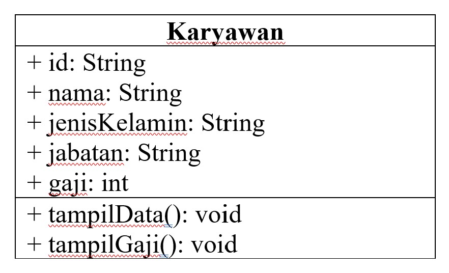
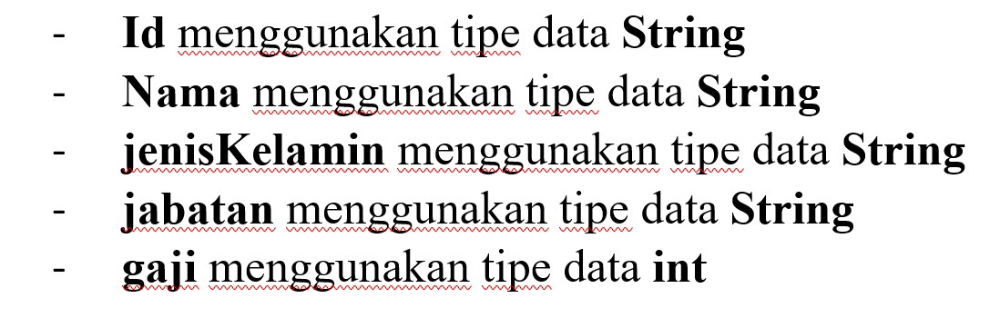
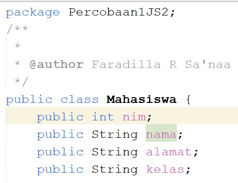
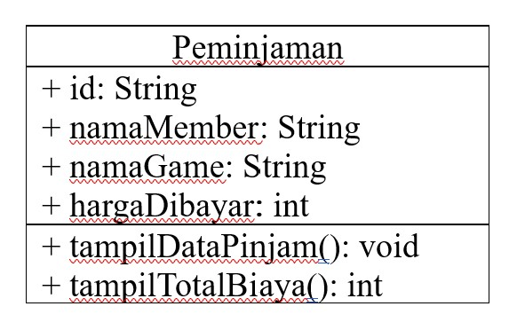
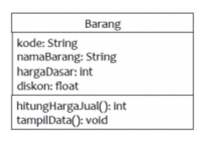

# Laporan Praktikum Jobsheet 2

Nama : Faradilla Roudhotul Sa'naa

Kelas/NIM : 2C/2241720205

Materi : Class dan Object

## Percobaan 1

Studi Kasus 1:

Dalam suatu perusahaan salah satu data yang diolah adalah data karyawan. Setiap karyawan memiliki id, nama, jenis kelamin, jabatan, jabatan, dan gaji. Setiap mahasiswa juga bisa menampilkan data diri pribadi dan melihat gajinya.

1. Gambarkan desain class diagram dari studi kasus 1!

   **Jawab :** 

2. Sebutkan Class apa saja yang bisa dibuat dari studi kasus 1!

   **Jawab :** Class karyawan dan Class main

3. Sebutkan atribut serta tipe datanya yang dapat diidentifikasi dari masing – masing class dari studi kasus 1!

   **Jawab :** 

4. Sebutkan method – method yang sudah anda buat dari masing – masing class pada studi kasus 1!

   **Jawab :** Method yang sudah dibuat adalah tampilData() yang dimana method tersbeut digunakan untuk menampilkan data karyawan, method tampilGaji() digunakan untuk menampilkan gaji karyawan.

## Percobaan 2

1. Jelaskan pada bagian mana proses pendeklarasian atribut pada program diatas!

   **Jawab :** 

2. Jelaskan pada bagian mana proses pendeklarasian method pada program diatas!

**Jawab :**

```java
public void tampilBiodata()
```

3. Berapa banyak objek yang di instansiasi pada program diatas!

   **Jawab :** Objek yang di instansiasi pada program diatas ada 1.

4. Apakah yang sebenarnya dilakukan pada sintaks program “mhs1.nim=101” ?

   **Jawab :** Mengubah nilai atribut dari suatu objek menjadi 101

5. Apakah yang sebenarnya dilakukan pada sintaks program “mhs1.tampilBiodata()” ?

   **Jawab :** Sintaks tersebut digunakan untuk memanggil pada Class yang lain dan ditampilkan pada Class main.

6. Instansiasi 2 objek lagi pada program diatas

   **Jawab :**

```java
        System.out.println("----------------------------");
        Mahasiswa mhs2 = new Mahasiswa();
        mhs2.nim = 102;
        mhs2.nama = "Faradilla Roudhotul Sa'naa";
        mhs2.alamat = "Jl. Bunga Pinang Merah II No 9";
        mhs2.kelas = "2C";
        mhs2.tampilBiodata();

        System.out.println("----------------------------");
        Mahasiswa mhs3 = new Mahasiswa();
        mhs3.nim = 103;
        mhs3.nama = "Hana Sugianto";
        mhs3.alamat = "Jl. Ikan Sepat No 10";
        mhs3.kelas = "2G";
        mhs3.tampilBiodata();
```

## Percobaan 3

1. Apakah fungsi argument dalam suatu method?

   **Jawab :** Fungsi argument dalam suatu method adalah untuk mengirim data yang akan digunakan dalam method tersebut.

2. Ambil kesimpulan tentang kegunaan dari kata kunci return, dan kapan suatu method harus memiliki return!

   **Jawab :** Return digunakan dalam suatu method untuk mengembalikan nilai, nilai dapat berupa tipe data apapun. Suatu method memerlukan return jika ingin mengembalikan suatu nilai.

## Tugas

1. Suatu toko persewaan video game salah satu yang diolah adalah peminjaman, dimana data yang dicatat ketika ada orang yang melakukan peminjaman adalah id, nama member, nama game, dan harga yang harus dibayar. Setiap peminjaman bisa menampilkan data hasil peminjaman dan harga yang harus dibayar. Buatlah class diagram pada studi kasus diatas!

   Penjelasan:

   - Harga yang harus dibayar diperoleh dari lama sewa x harga.
   - Diasumsikan 1x transaksi peminjaman game yang dipinjam hanya 1 game saja.

   **Jawab :** 

2. Buatlah program dari class diagram yang sudah anda buat di no 1!

   **Jawab :** Kode program ada pada file java.

3. Buatlah program sesuai dengan class diagram berikut ini:
   

   **Jawab :** Kode program ada pada file java.

4. Buatlah program sesuai dengan class diagram berikut ini:
   

   Deskripsi / Penjelasan :

   - Nilai atribut hargaDasar dalam Rupiah dan atribut diskon dalam %
   - Method hitungHargaJual() digunakan untuk menghitung harga jual dengan perhitungan berikut ini: harga jual = harga dasar – (diskon x harga dasar)
   - Method tampilData() digunakan untuk menampilkan nilai dari kode, namaBarang, hargaDasar, diskon dan harga jual

   **Jawab :** Kode program ada pada file java.
