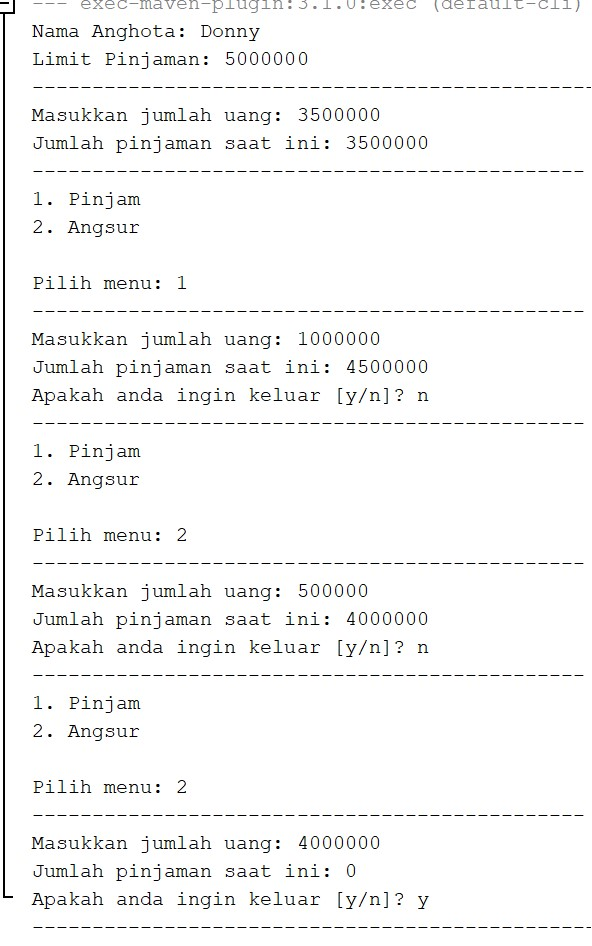

# Laporan Praktikum Jobsheet 3

Nama : Faradilla Roudhotul Sa'naa

Kelas / NIM : 2C / 2241720205

Materi : Enkapsulasi

## Percobaan 1 dan 2

1. Pada class TestMobil, saat kita menambah kecepatan untuk pertama kalinya, mengapa muncul peringatan “Kecepatan tidak bisa bertambah karena Mesin Off!”?

   **Jawab :** Karena pada awal kita belum menyalakan mesin sehingga kontakOn = false karena secara logika pun tidak dapat menambah kecepatan. Selain itu juga karena tidak memenuhi kondisi tambahKEcepatan() sehingga yang ditampilkan adalah pernytaan else. 

2. Mengapat atribut kecepatan dan kontakOn diset private?

   **Jawab :** Karena akan tidak logis apabila dapat mengatur kecepatan dan mesin secara langsung sehingga perlu di-privte agar hanya dapat berubah saat terjadi proses. 

3. Ubah class Motor sehingga kecepatan maksimalnya adalah 100!

   **Jawab :**
   
   * Modifikasi method tambahKecepatan
   ```java
   public void tambahKecepatan() {
        if (kecepatan == 100) {
            System.out.println("Kecepatan tidak bisa bertambah karena telah mencapai batas!");
        } else {
            if (kontakOn == true) {
                kecepatan += 20;
            } else {
                System.out.println("Kecepatan tidak bisa bertambah karena Mesin Off! \n");
            }
        }
    }
    ```

    * Modifikasi class Main 
    ```java
   public static void main(String[] args) {
        Motor motor = new Motor();
        
        motor.nyalakanMesin();
        motor.printStatus();
        motor.tambahKecepatan();
        motor.tambahKecepatan();
        motor.tambahKecepatan();
        motor.tambahKecepatan();
        motor.tambahKecepatan();
        motor.printStatus();
        motor.tambahKecepatan();
    }
    ```

   * Hasil Output
   

## Percobaan 3 dan 4

1. Apa yang dimaksud getter dan setter?

   **Jawab :** Getter dan setter adalah suatu method public yang digunakan untuk mendapatkan dan memanipulasi nilai yang memiliki modifier private. 

2. Apa kegunaan dari method getSimpanan()?

   **Jawab :** Method tersebut digunakan untuk mengambil nilai dari simpanan. 

3. Method apa yang digunakan untuk menambah saldo?

   **Jawab :** Method setor.

4. Apa yand dimaksud konstruktor?

   **Jawab :** Konstruktor adalah sebuah method istimewa yang dieksekusi pertama kali ketika instansiasi dari objek. 

5. Sebutkan aturan dalam membuat konstruktor?

   **Jawab :** 
   * Nama konstruktor harus sama dengan nama class.
   
   * Konstruktor tidak memiliki tipe data return.

   * Konstruktor tidak boleh menggunakan modifier abstract, tstaic, final. 
6. Apakah boleh konstruktor bertipe private?

   **Jawab :** Mungkin boleh, tetapi lebih umum bersifat public karena akan digunakan pada class lain. 

7. Kapan menggunakan parameter dengan passsing parameter?

   **Jawab :** Ketika method tersebut membutuhkan suatu nilai yang tidak ada dalam method tersebut atau mengambil nilai dari luar method.

8. Apa perbedaan atribut class dan instansiasi atribut?

   **Jawab :** 
   * Atribut class adalah atribut yang dimiliki oleh class, untuk mengaksesnya tidak perlu proses instansiasi dahulu dan semua objek yang dibuat dari kleas tersebut akan terbagi nilai yang sama untuk atribut kelas.

   * Instansiasi atribut adalah atribut yang dimiliki oleh objek atau instance yang mengharuskan instansiasi objek terlebih dahulu agar dapat diakses dan setiap objek memiliki salinan sendiri dari atrbiut dengan nilai yang mungkin saja berbeda. 

9. Apa perbedaan class method dan instansiasi method?

   **Jawab :** Sama seperti soal nomor 8 bahwa, jika class method maka untuk mengaksesnya tidak perlu proses instansiasi sedangkan untuk instansiasi diperlukan adanya instansiasi objek agar dapat diakses.  

## Tugas

1. Cobalah program dibawah ini dan tuliskan hasil outputnya

   **Jawab :**

   

2. Pada program diatas, pada class EncapTest kita mengeset age dengan nilai 35, namun pada saat ditampilkan ke layar nilainya 30, jelaskan mengapa.

   **Jawab :** Karena pada method setAge yang terdapat dalam class EncapDemo yang dimana terdapat if umur baru (newAge) yang diset pada class EncapTest lebih besar daripada 30 maka umur akan tetap 30.

3. Ubah program diatas agar atribut age dapat diberi nilai maksimal 30 dan minimal 18.
      
   **Jawab :**

   * Modifikasi method setAge
   ```java
   public void setAge(int newAge) {
        if (newAge > 30) {
            age = 30;
        } else if (newAge < 18) {
            age = 18;
        } else {
            age = newAge;
        }
    }
   ```

   * Class Main
   ```java
   public static void main(String[] args) {
        EncapDemo encap = new EncapDemo();
        encap.setName("James");
        encap.setAge(35);
        
        EncapDemo encap2 = new EncapDemo();
        encap2.setName("Faradilla Roudhotul Sa'naa");
        encap2.setAge(15);
        
        System.out.println("Name    : " + encap.getName());
        System.out.println("Age     : " + encap.getAge());
        System.out.println("--------------------------");
        System.out.println("Name    : " + encap2.getName());
        System.out.println("Age     : " + encap2.getAge());
    }
   ```
   * Output 

   

4.	Pada sebuah sistem informasi koperasi simpan pinjam, terdapat class Anggota yang memiliki atribut antara lain nomor KTP, nama, limit peminjaman, dan jumlah pinjaman. Anggota dapat meminjam uang dengan batas limit peminjaman yang ditentukan. Anggota juga dapat mengangsur pinjaman. Ketika Anggota tersebut mengangsur pinjaman, maka jumlah pinjaman akan berkurang sesuai dengan nominal yang diangsur. Buatlah class Anggota tersebut, berikan atribut, method dan konstruktor sesuai dengan kebutuhan. Uji dengan TestKoperasi berikut ini untuk memeriksa apakah class Anggota yang anda buat telah sesuai dengan yang diharapkan.

      **Jawab :** Source code ada pada file. 
      
      * Output

      

5.	Modifikasi soal no. 4 agar nominal yang dapat diangsur minimal adalah 10% dari jumlah pinjaman saat ini. Jika mengangsur kurang dari itu, maka muncul peringatan “Maaf, angsuran harus 10% dari jumlah pinjaman”.

      **Jawab :** 
      
      * Modifikasi
      

      * Output 

      

6.	Modifikasi class TestKoperasi, agar jumlah pinjaman dan angsuran dapat menerima input dari console.

      **Jawab :** 
      * Modifikasi
      ```java
      package com.mycompany.koperasisimpanpinjam;
      import java.util.Scanner;
      /**
      *
      * @author Faradilla R Sa'naa
      */
      public class TestKoperasi {
         
         public static int jumlahPinjam, jumlahAngsur;
         public static int menu;
         public static char pilihan;
         
         public static void main(String[] args) {
            Scanner nana = new Scanner(System.in);
            
            Anggota donny = new Anggota("111333444", "Donny", 5000000);
            
            System.out.println("Nama Anggota: " + donny.getNama());
            System.out.println("Limit Pinjaman: " + donny.getLimitPinjaman());
            System.out.println("--------------------------------------------------");
            System.out.print("Masukkan jumlah uang: ");
            jumlahPinjam = nana.nextInt();
            donny.pinjam(jumlahPinjam);
            System.out.println("Jumlah pinjaman saat ini: " + donny.getJumlahPinjam());
            
            do {
                  System.out.println("----------------------------------------------");
                  System.out.println("1. Pinjam");
                  System.out.println("2. Angsur");
                  System.out.print("\nPilih menu: ");
                  menu = nana.nextInt();
                  System.out.println("----------------------------------------------");
                  if (menu == 1) {
                     System.out.print("Masukkan jumlah uang: ");
                     jumlahPinjam = nana.nextInt();
                     donny.pinjam(jumlahPinjam);
                     System.out.println("Jumlah pinjaman saat ini: " + donny.getJumlahPinjam());
                  } else if (menu == 2) {
                     System.out.print("Masukkan jumlah uang: ");
                     jumlahAngsur = nana.nextInt();
                     donny.angsur(jumlahAngsur);
                     System.out.println("Jumlah pinjaman saat ini: " + donny.getJumlahPinjam());
                  }
                  System.out.print("\nApakah anda ingin keluar [y/n]? ");
                  pilihan = nana.next().charAt(0);
            } while (pilihan == 'n');
         }
      }
      ``` 
      * Output

      

 

