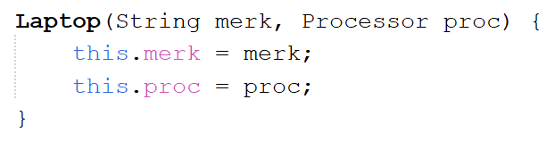
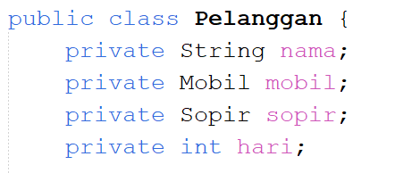
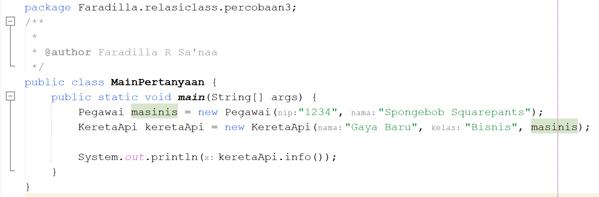
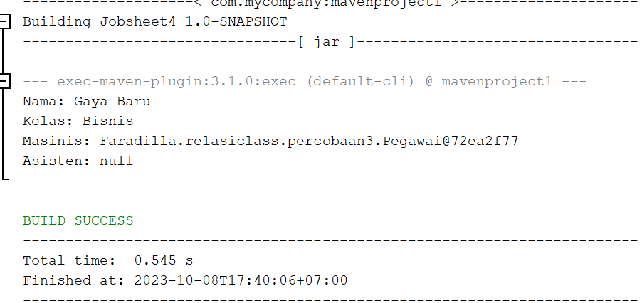
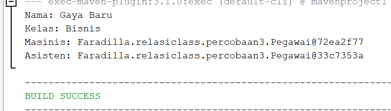
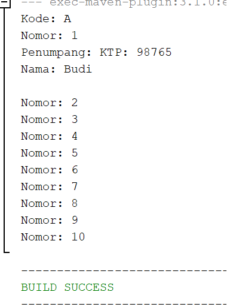
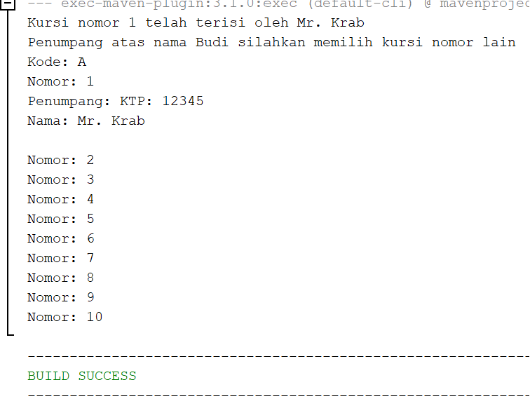
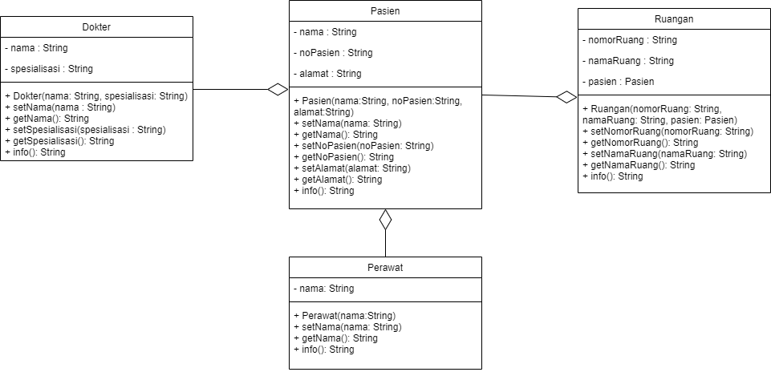

# Laporan Praktikum Jobsheet 4 

Nama : Faradilla Roudhotul Sa'naa <br>
Kelas / NIM : 2C / 2241720205 <br>
Materi : Relasi Class

## Percobaan 1 

1. Di dalam class Processor dan class Laptop , terdapat method setter dan getter untuk 
masing‑masing atributnya. Apakah gunanya method setter dan getter tersebut ? <br>
    **Jawab :** Setter digunakan untuk mengatur nilai atribut atau nilai objek dari class tersebut. Getrer digunakan untuk mengambil nilai atribut atau nilai objek dari class tersebut.

2. Di dalam class Processor dan class Laptop, masing‑masing terdapat konstruktor 
default dan konstruktor berparameter. Bagaimanakah beda penggunaan dari kedua jenis 
konstruktor tersebut ? <br>
    **Jawab :** Konstruktor default digunakan untuk objek yang sudah memiliki nilai default. Konstruktor berparameter digunakan untuk objek yamg belum memiliki nilai default (nilai dari atribut yang daapt diisi pada class main).

3. Perhatikan class Laptop, di antara 2 atribut yang dimiliki (merk dan proc), atribut 
manakah yang bertipe object ? <br>
    **Jawab :** Atribut yang memiliki tipe data objek adalah proc, karena proc berasal dari objek processoe yang dijadikan atribut untuk objek laptop. 

4. Perhatikan class Laptop, pada baris manakah yang menunjukan bahwa class Laptop
memiliki relasi dengan class Processor ? <br>
    **Jawab :**  <br> Konstruktor laptop menggunakan parameter proc dan memiliki tipe data processor yang merupakan sebuah objek. 

5. Perhatikan pada class Laptop , Apakah guna dari sintaks proc.info() ? <br>
    **Jawab :** KEgunaan sintajs proc.info() adalah untuk mengambil nilai method info pada class processor yang dimana berisikan atribut (merk dan cache). 

6. Pada class MainPercobaan1, terdapat baris kode:
Laptop l = new Laptop("Thinkpad", p);. <br>
Apakah p tersebut ? Dan apakah yang terjadi jika baris kode tersebut diubah menjadi: <br>
Laptop l = new Laptop("Thinkpad", new Processor("Intel i5", 3)); <br>
Bagaimanakah hasil program saat dijalankan, apakah ada perubahan ? <br>
    **Jawab :** <br> 
    * P adalah objek yang dibuat dari class processor yang dimana digunakan untuk mengisi parameter dari objek processor yang dibutuhkan. <br> 
    * Tidak akan ada perubahan bila kode program diganti menjadi Laptop l = new Laptop("Thinkpad", new Processor("Intel i5", 
    3));, karena kode program tersebut adalah cara untuk mengisi atribut proc dengan instansiasi objek processor.

## Percobaan 2
1. Perhatikan class Pelanggan. Pada baris program manakah yang menunjukan bahwa class
Pelanggan memiliki relasi dengan class Mobil dan class Sopir ? <br>
    **Jawab :** <br>  <br> 
    Kode program diatas menunjukkan class Pelanggan memiliki relasi dengan class Mobil dan class Sopir, karena atribut dari class tersebut adalah objek dari class Mobil dan Sopir. 

2. Perhatikan method hitungBiayaSopir pada class Sopir, serta method 
hitungBiayaMobil pada class Mobil. Mengapa menurut Anda method tersebut harus 
memiliki argument hari ? <br>
    **Jawab :** Menurut saya method tersebut memerlukan argumen hari dikarenakan diperlukan data berapa lama mobil dan sopir disewa untuk bisa menghitung total biaya mobil dan sopir. 

3. Perhatikan kode dari class Pelanggan. Untuk apakah perintah
mobil.hitungBiayaMobil(hari) dan sopir.hitungBiayaSopir(hari) ? <br>
    **Jawab :** mobil.hitungBiayaMobil(hari) digunakan untuk mengakses objek mobil dan menghitung sopir.hitungBiayaSopir(hari) untuk mengakses objek sopir yang digunakan untuk menghitung total biaya masing-masing setelah disewa. 

4. Perhatikan class MainPercobaan2. Untuk apakah sintaks p.setMobil(m) dan
p.setSopir(s) ? <br>
    **Jawab :** Sintaks tersebut digunakan untuk mengisi atribut pada objek pelanggan yang dimana atributnya merupakan objek dari class mobil dan sopir. 

5. Perhatikan class MainPercobaan2. Untuk apakah proses p.hitungBiayaTotal()
tersebut ? <br>
    **Jawab :** Proses tersebut digunakan untuk mengakses method hitungBiayaTotal() yang berada pada class pelanggan, yang dimana digunakan untuk menghitung total biaya yang harus dibayarkan. 

6. Perhatikan class MainPercobaan2, coba tambahkan pada baris terakhir dari method
main dan amati perubahan saat di‑run! <br>
System.out.println(p.getMobil().getMerk());
Jadi untuk apakah sintaks p.getMobil().getMerk() yang ada di dalam method 
main tersebut? <br>
    **Jawab :** Sintaks tersebut digunakan untuk mengakses objek mobil yang merupakan atribut dari objek pelanggan, yang kemudian objek mobil tersebut akan mengambil nilai atribut merk menggunakan getter. 

## Percobaan 3
1. Di dalam method info() pada class KeretaApi, baris this.masinis.info() dan
this.asisten.info() digunakan untuk apa ? <br>
    **Jawab :** Method tersebut digunakan untuk mengakses menthod info() yang berada pada class pegawai. 

2. Buatlah main program baru dengan nama class MainPertanyaan pada package yang 
sama. Tambahkan kode berikut pada method main() ! <br>
Pegawai masinis = new Pegawai("1234", "Spongebob 
Squarepants");
KeretaApi keretaApi = new KeretaApi("Gaya Baru", "Bisnis", 
masinis);
System.out.println(keretaApi.info()); <br>
    **Jawab :** 

3. Apa hasil output dari main program tersebut ? Mengapa hal tersebut dapat terjadi ? <br>
    **Jawab :**  <br> 
    Hal tersebut terjadi karena pada objek asisten tidak memiliki isi, sehingga muncul null. 

4. Perbaiki class KeretaApi sehingga program dapat berjalan ! <br>
    **Jawab :** <br>
    ```java
    public class MainPertanyaan {
        public static void main(String[] args) {
            Pegawai masinis = new Pegawai("1234", "Spongebob        Squarepants");
            Pegawai asisten = new Pegawai("98765", "Faradilla Roudhotul Sa'naa");
            KeretaApi keretaApi = new KeretaApi("Gaya Baru", "Bisnis", masinis, asisten);
            System.out.println(keretaApi.info());
        }
    }
    ```
    Output 
    

## Percobaan 4
1. Pada main program dalam class MainPercobaan4, berapakah jumlah kursi dalam 
Gerbong A ? <br>
    **Jawab :** Jumlah kursi pada gerbong A adalah 10. 

2. Perhatikan potongan kode pada method info() dalam class Kursi. Apa maksud kode 
tersebut ? <br>
...
if (this.penumpang != null) {
info += "Penumpang: " + penumpang.info() + "\n";
}
... <br>
    **Jawab :** Kode tersebut digunakan jika penumpang tidak kosong maka info penumpang akan dicetak. 

3. Mengapa pada method setPenumpang() dalam class Gerbong, nilai nomor dikurangi 
dengan angka 1 ? <br>
    **Jawab :** Karena array dimulai dari indeks 0 maka perlu dikurangi 1 agar dapat mengakses nomor yang sesuai dengan yang disimpang oleh array. 

4. Instansiasi objek baru budi dengan tipe Penumpang, kemudian masukkan objek baru 
tersebut pada gerbong dengan gerbong.setPenumpang(budi, 1). Apakah yang terjadi ? <br>
    **Jawab :** <br>
    ```java
        public class MainPercobaan4 {
        public static void main(String[] args) {
            Penumpang p = new Penumpang("12345", "Mr. Krab");
            Gerbong gerbong = new Gerbong("A", 10);
            gerbong.setPenumpang(p, 1);
            
            Penumpang Budi = new Penumpang("98765", "Budi");
            gerbong.setPenumpang(Budi, 1);
            
            System.out.println(gerbong.info());
            }
        }
    ``` 
    

5. Modifikasi program sehingga tidak diperkenankan untuk menduduki kursi yang sudah ada 
penumpang lain ! <br>
    **Jawab :** <br>
    ```java
        public void setPenumpang(Penumpang penumpang, int nomor) {
        Kursi kursi = this.arrayKursi[nomor - 1];
        if (kursi.getPenumpang() == null) {
            kursi.setPenumpang(penumpang);
        } else {
            System.out.println("Kursi nomor " + nomor + " telah terisi oleh " 
                    + kursi.getPenumpang().getNama());
            System.out.println("Penumpang atas nama " + penumpang.getNama()
                    + " silahkan memilih kursi nomor lain");
        }
        }
    ```
    Output 
    

## Tugas 
Berdasarkan latihan di pertemuan teori, rancang dengan class diagram, kemudian implementasikan 
ke dalam program! Studi kasus harus mewakili relasi class dari percobaan‑percobaan yang telah 
dilakukan pada materi ini, setidaknya melibatkan minimal 4 class (class yang berisi main tidak 
dihitung). <br>
    **Jawab :** Kode program berada pada file. <br>
    Class Diagram 
        


