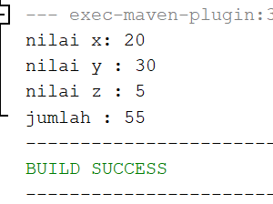
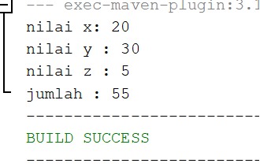
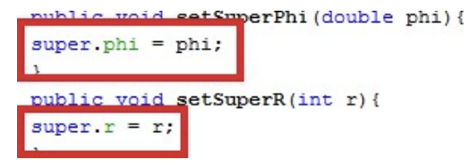
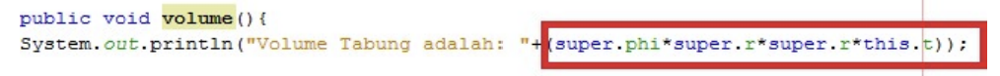
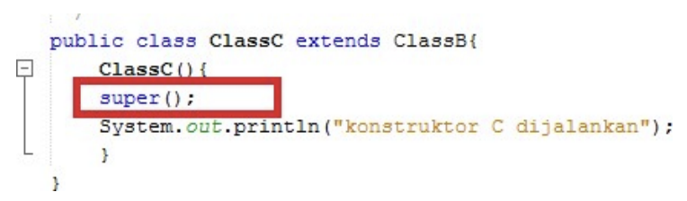
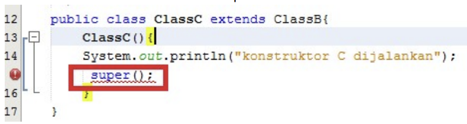
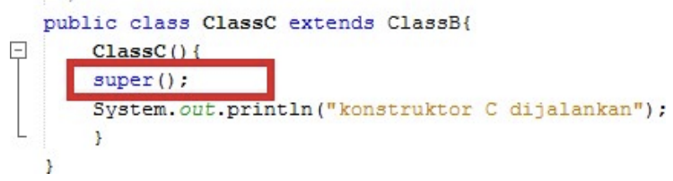
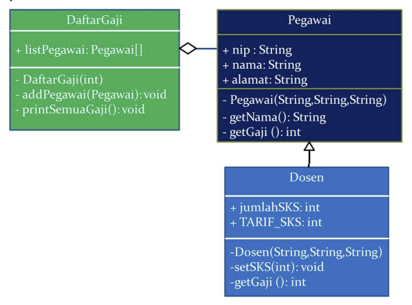

# Jobsheet 6 - Inheritance 

Nama : Faradilla Roudhotul Sa'naa <br>
Kelas / NIM : 2C / 2241720205 <br>
Materi : Inheritance

## Percobaan 1 
1. Pada percobaan 1 diatas program yang dijalankan terjadi error, kemudian perbaiki sehingga program tersebut bisa dijalankan dan tidak error! <br>
    **Jawab :** 
    ```java
    public class ClassB extends ClassA {
        public int z;
        
        public void getNilaiZ() {
            System.out.println("nilai z : " + z);
        }
        
        public void getJumlah() {
            System.out.println("jumlah : " + (x + y+ z));
        }
    }
    ```
    Output : <br>
    

2. Jelaskan apa penyebab program pada percobaan 1 ketika dijalankan terdapat error! <br>
    **Jawab :** Penyebab terjadinya error pada percobaan 1 adalah tidak adanya "extends" pada subclass atau child class, karena pada subclass terjadi pemanggilan atribut dari parent class. Maka jika tidak diberi "extends" akan terjadi error karena "extends" bisa disebut sebagai penyambung. 

## Percobaan 2 
1. Pada percobaan 2 diatas program akan dijalankan terjadi error, kemudian perbaiki sehingga program tersebut bida dijalanakn dan tidak error! <br>
    **Jawab :** 
    ```java
    public class ClassA {
        public int x;
        public int y;
        
        public void setX(int x) {
            this.x = x;
        }
        
        public void setY(int y) {
            this.y = y;
        }
        
        public void getNilai() {
            System.out.println("nilai x: " + x);
            System.out.println("nilai y : " + y);
        }
    }
    ```
    Output : <br>
    

2. Jelaskan apa penyebab program pada percobaan 1 ketika dijalankan terdapat error! <br>
    **Jawab :** Penyebab terjadinya error pada percobaan ini adalah adanya pemberian hak akses private pada parent class, yang dimana jika suatu atribut pada parent class ini memiliki hak akses private maka atribut tersebut tidak dapat digunakan oleh subclass atau child class. Maka perbaikan yang dapat dilakukan adalah mengganti hak akses atribut private menjadi public agar dapat diakses oleh child class. 

## Percobaan 3
1. Jelaskan fungsi "super" pada potongan program berikut di class Tabung! <br>  <br>
    **Jawab :** Kata kunci super digunakan untuk meurujuk pada member dari parent class. Yang dimana kata kunci ini tidak bisa dipakai untuk member pada subclass atau chils class. Penggunaan kata kunci "super" tidak hanya untuk sebuah atribut, tetapi bisa juga untuk method, konstruktor kosong, dan juga konstruktor ber-parameter.    

2. Jelaskan fungsi "super" dan "this" pada potongan program berikut di class Tabung! <br>  <br>
    **Jawab :** Fungsi "super" pada class tabung yaitu untuk mengakses member dari parent class, yaitu class Bangun yang dimana member tersebut dapat diakses karena berada dalam package yang sama. Kata kunci "this" hanya dapat digunakan untuk member dari class itu sendiri. 

3. Jelaskan mengapa pada class Tabung tidak dideklarasikan atrbiut "phi" dan "r" tetapi class tersebut dapat mengakses atribut tersebut! <br>
    **Jawab :** Karena atribut "phi" dan "r" memiliki hak akses protected yang dimana maksud dari hak akses tersebut adalah atribut dapat diakses jika berada pada class yang sama, package yang sama, dan juga subclass yang sama. Tetapi tidak dapat diakses di class manapun.

## Percobaan 4
1. Pada percobaan 4 sebutkan mana class yang termasuk superclass dan subclass, kemudian jelaskan alasannya! <br>
    **Jawab :** Yang termasuk superclass adalah ClassA, karena ClassA adalah kelas dasar. ClassB termasuk subclass dari ClassA karena ClassB diwarisi atribut dari ClassA dan ClassB superclass bagi ClassC. ClassC sublcass dari ClassB yang dimana isi dari ClassC diperluas dari ClassB. 

2. Ubahlah isi konstruktor default ClassC seperti berikut <br>  <br> Tambahkan kata super() di baris pertama dalam konstruktor defaultnya. Coba jalankan kembali class Percobaan4 dan terlihat tidak ada perbedaan dari hasil outputnya! <br>
    **Jawab :** Ketika super() ditambahkan di baris pertama dalam konstruktor default yang dimana sebenarnya konstruktor dari ClassB dipanggil sebelum menjalankan konstruktor ClassC. Memanggil konstrukto superclass dengan suoer() atau super(parameters) adalah sebuah syarat default. Karena konstrukto ClassB adalah konstruktor default, maka dipanggil oleh super() sehingga tidak ada hasil yang berbeda dari sebelumnya. 

3. Ubahlah isi konstruktor default ClassC seperti berikut: <br>  <br> Ketika posisi super() dibaris kedua dalam konstruktor defaultnya dan terliaht ada error. Kemudian kembalikan super() kebaris pertama seperti sebelumnya, maka errirnya akan hilang. Perhatikan hasil keluaran ketika class Percobaan4 dijalankan. Kenapa bisa tampil output seperti berikut pada saat instansiasi objek test dari class ClassC. <br>  <br> Jelaskan bagaimana urutan proses jalannya konstruktor saat objek test dibuat! <br>
    **Jawab :** <br>
    * Saat posisi super() diubah ke baris kedua dalam konstruktor default ClassC maka akan terjadi error karena kesalahan dalam aturan bahasa java. Konstruktor pada sebuah class harus dipanggil pada baris pertama, namun jika super() akan dipanggil setelah instruksi lain dalam konstruktor, maka akan menimbulkan kesalahan pada java. <br>
    * Saat posisi super() diletakkan pada baris kedua maka konstruktor pada ClassC akan memanggil konstruktor ClassB dahulu setelah itu akan menjalankan instruksi dalam konstruktor ClassC. Meskipun super() dipindahkan ke baris kedua, java akan tetap memaksa untuk memanggil superclass telebih dulu. 
    * Saat super() dipindahkan ke baris kedua, output yang ditampilkan ketika objest dari ClassC dibuat akan mencetak "Konstruktor B dijalankan" dahulu, setelah itu maka "Konstrukot C dijalankan". 

4. Apakah fungsi super() pada potongan program dibawah ini ClassC! <br>

    **Jawab :** Fungsi super() adalah untuk memanggil konstruktor superclass sebelum menjalankan konstruktor ClassC. Yang dimana, sebelum menjalankan insturksi dalam konstruktot ClassC, java akan menjalankan konstruktor ClassB dahulu. 

## Tugas 
1. Buatlah sebuah program dengan konsep pewarisan seperti pada class diagram dibawah berikut ini. Kemudian buatlah instansiasi objek untuk menampilkan data nama pegawai dan gaji yang didapatkannya. <br>  <br>
    **Jawab :** Kode program ada pada file project tugas. 


