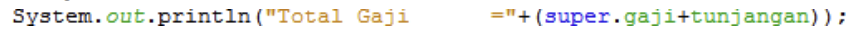
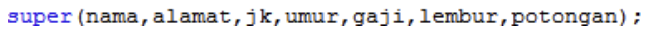
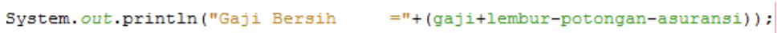
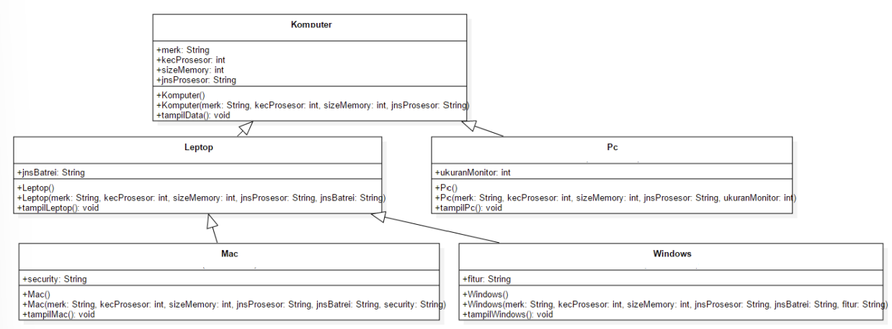

# Jobsheet  7 : Inheritance 2

Nama : Faradilla Roudhotul Sa'naa  
Kelas / NIM : 2C / 2241720205  
Materi : Inheritance 2 

## Percobaan 1 
1. Sebutkan class mana yang termasuk super class dan sub class dari percobaan 1 diatas!  
    **Jawab :** Class Karyawan adalah super class, karena atribut dari class Karyawan akan mewarisi pada sub class. Sedangkan yang termasuk sub class adalah Staff dan Manager. 

2. Kata kunci apakah yang digunakan untuk menurunkan suatu class ke class yang lain?  
    **Jawab :** Kata kunci yang digunakan untuk menurunkan suatu class ke class lain adalah **extends** yang dimana kata kunci ini memberitahu kompiler Java bahwa kita ingin melakukan perluasan class. 

3. Perhatikan kode program pada class Manager, atribut apa saja yang dimiliki oleh class tersebut? Sebutkan atribut mana saja yang diwarisi dari class karyawan!  
    **Jawab :** Atribut yang dimiliki oleh class Manager adalah tunjangan. Class Manager diwarisi oleh class Karyawan sehingga class Manager memiliki atribut yang diwarisi yaitu nama, alamat, umur, jk, dan gaji. 

4. Jelaskan kata kunci super pada potongan program dibawah ini yang terdapat pada class Manager!     
    **Jawab :** Kata kunci super pada potongan program dibawah digunakan untuk memanggil atau menggunakan atribut yang berada pada induk class dan dengan hak akses public, jika hak akses private maka tidak bisa dipanggil. 

5. Program pada percobaan 1 diatas termasuk dalam jenis inheritance apa? Jelaskan alasannya!  
    **Jawab :** Percobaan 1 termasuk dalam hierarchical inheritance, yang dimana induk class memiliki class turunan lebih dari satu. 

## Percobaan 2 
1. Berdasarkan class diatas manakah yang termasuk single inheritance dan aman yang termasuk multilevel inheritance!  
    **Jawab :** Pada percobaan ini yang termasuk pada single inheritance adalah class Karyawan yang mewarisi class Manager dan Staff. Sedangkan yang termasuk pada multilevel inheritance adalah class Staff yang mewarisi class StaffHarian dan StaffTetap. 

2. Perhatikan kode program class StaffTetap dan StaffHArian, atribut apa saja yang dimiliki oleh class tersebut? Sebutkan atribut mana saja yang diwarisi dari class Staff!  
    **Jawab :** Atribut yang dimiliki oleh class StaffTetap adalah gollongan dan asuransi, sedangkan atribut yang dimiliki oleh class StaffHarian adalah jumlah jam kerja. Kedua class tersebut diwarisi oleh class Staff sehingga memiliki atribut yang terdapat pada class Staff, yaitu lembur dan potongan. Karena class Staff merupakan sub class dari class Karyawan maka class StaffHarian dan Stafftetap juga memiliki atribut dari class Karyawan yang berisi nama, alamat, umur, jk, dan gaji. 

3. Apakah fungsi potongan program berikut pada class StaffHarian     
    **Jawab :** Fungsi dari potongan program diatas adalah dimana digunakannya kata kunci super untuk hak akses atribut yang berada pada class induk, pada potongan program diatas hak akses digunakan untuk atribut nama, alamat, jk, umur, gaji, lembur, potongan. 

4. Apakah fungsi potongan program berikut pada class StaffHarian     
    **Jawab :** Fungsi dari potongan program diatas adalah untuk menggunakan method yang berada pada class induk, yang dimana class Staff adalah kelas induk dari class StaffHarian dan class StaffTetap. 

5. Perhatikan kode program dibawah ini yang terdapat pada class StaffTetap      Terlihat dipotongan program diatas atribut gaji, lembur dan potongan dapat diakses langsung. Kenapa hal ini bisa terjadi dan bagaimana class StaffTetap memiliki atribut gaji, lembur, dan potongan padahal dalam class tersebut tidak dideklarasikan atribut gaji, lembur, dan potongan?  
    **Jawab :** Atribut dapat diakses langsung dikarenakan adanya kata kunci extends untuk sub class tersebut. Class StaffTetap dan StaffHarian dapat mengakses atribut tersebut meskipun tidak dideklarasikan, karena terdapat kata kunci super yang digunakan untuk mengakses atribut dari super class. 

## Tugas
1. Buatlah sebuah program dengan konsep pewarisan seperti pada class diagram berikut ini. Kemudian buatlah instansiasi objek untuk menampilkan data pada class MAc, Windows dan Pc!  
  
    **Jawab :** Kode program berada pada file. 