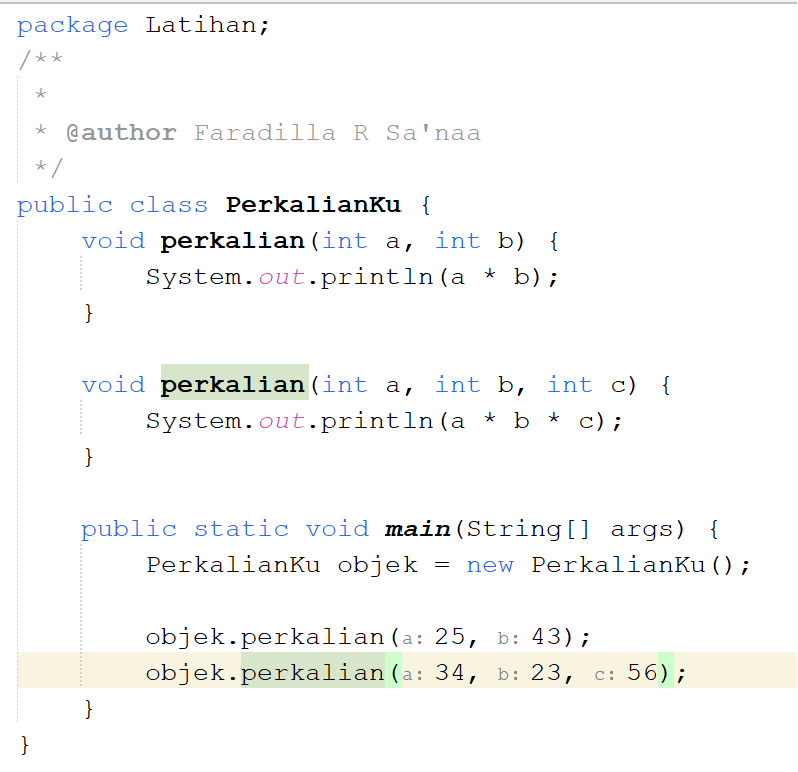
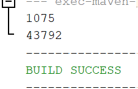
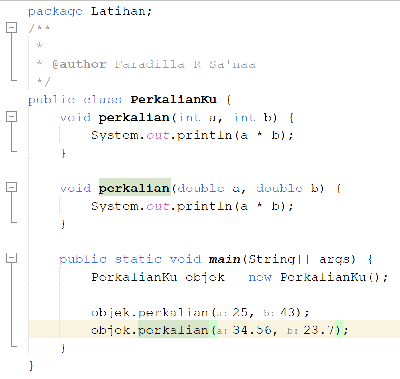
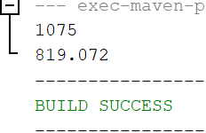
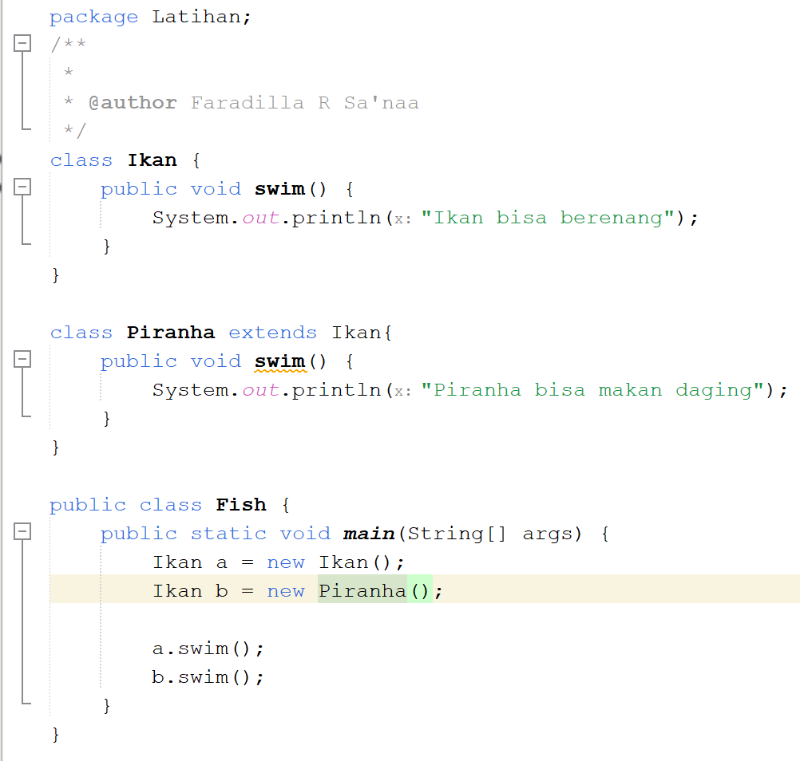
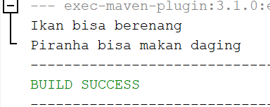
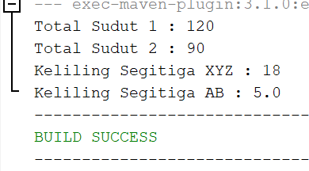
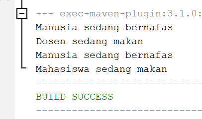

# Jobsheet 9 : Overloading dan Overriding

Nama : Faradilla Roudhotul Sa'naa  
Kelas / NIM : 2C / 2241720205  
Materi : Overloading dan Overriding 

# Latihan 
a. Kode Program  
   Hasil Run     

### Pertanyaan :  
1. Dari source coding diatas terletak dimanakah overloading?  
    **Jawab :** Terletak pada method perkalian yang di definisi dua kali dengan parameter yang berbeda. 
2. Jika terdapat overloading ada berapa jumlah parameter yang berbeda?  
    **Jawab :** Jumlah parameter yang berbeda yaitu satu, yang dimana pada method pertama memiliki dua parameter dan pada method kedua memiliki tiga parameter. 

b. Kode Program  
   Hasil Run     

### Pertanyaan :  
1. Dari source coding diatas terletak dimanakah overloading?  
    **Jawab :** Terletak pada method perkalian yang di definisi dua kali dengan tipe data parameter yang berbeda.  
2. Jika terdapat overloading ada berapa tipe parameter yang berbeda?  
    **Jawab :** Terdapat satu tipe parameter yang berbeda, yang dimana pada method pertama bertipe data int dan pada method kedua bertipa data double. 

c. Kode Program  
   Hasil Run     

### Pertanyaan :
1. Dari source coding diatas terletak dimanakah overriding?  
    **Jawab :** Terletak pada method swim yang terdefinisi pada kelas piranha, menggantikan method yang sama pada kelas Ikan.  
2. Jabarkanlah apabila sourcoding duatas jika terdapat overriding?  
    **Jawab :** Method swim pada kelas Piranha merupakan overriding dari kelas Ikan. Ketika objek Piranha dipanggil memanggil method swim maka yang terpanggil adalah method swim pada kelas Piranha bukan pada kelas Ikan. 

# Tugas
1. Overloading  
Hasil Running  
  
2. Overriding  
Hasil Running  

