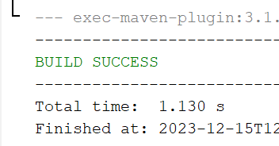
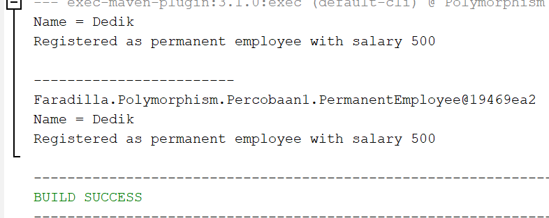
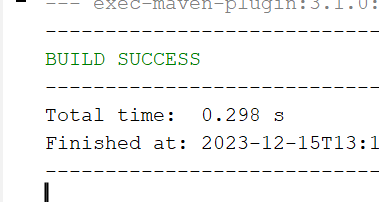
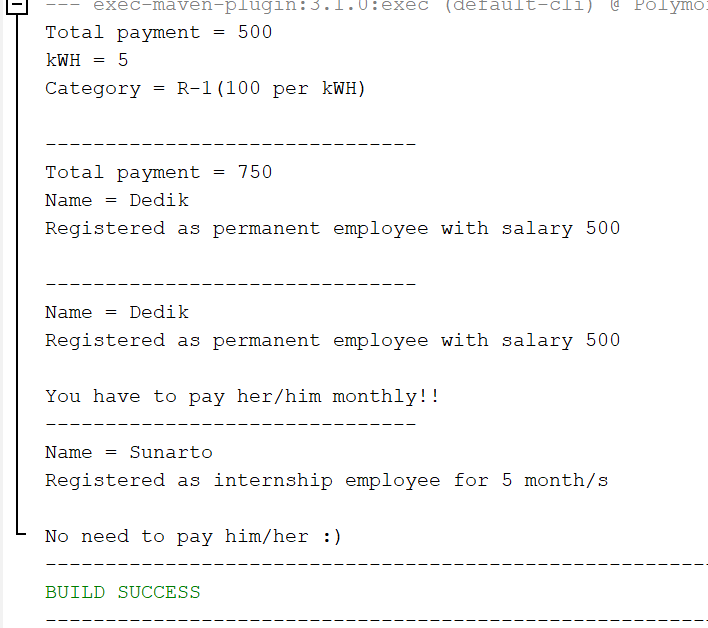
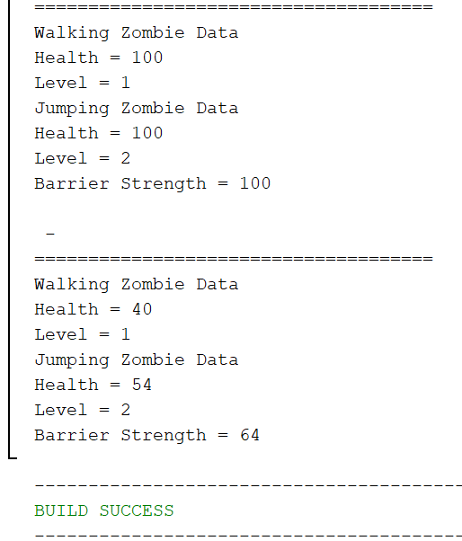

# Jobsheet 10 : Polimorfisme 

Nama : Faradilla Roudhotul Sa'naa  
Kelas / NIM : 2C / 2241720205  

## 1. Bentuk Dasar Polimorfisme 
Hasil running :    

## Pertanyaan 4.2 
1. Class apa sajakah yang merupakan turunan dari class Employee?  
    **Jawab :** PermanentEmployee dan InternshipEmployee.  
2. Class apa sajakah yang implements ke interface Payable?  
    **Jawab :** PermanentEmployee dan ElectricityBill.  
3. Perhatikan class Tester1, baris ke-10 dan 11. Mengapa e, bisa diisi dengan objek pEmp (merupakan objek dari class PermanentEmployee) dan objek iEmp (merupakan objek class InternshipEmployee)?  
    **Jawab :** e dapat diisi dengan objek karena keduanya merupakan turunan dari class Employee.  
4. Perhatikan class Tester1, baris ke-12 dan 13. Mengapa p, bisa diisi dengan objek pEmp (merupakan objek dari class PermanentEmployee) dan objek eBill (merupakan objek dari class ElectricityBill)?  
    **Jawab :** p dapat diisi dengan objek karena mengimplementasikan interface Payable. Objek yang mengimplementasikan interface ini ditetapkan ke variable tipe interface.  
5. Coba tambahkan sintaks : p = iEmp; dan e = eBill; pada baris 14 dan 15 (baris terakhir dalam method main)! Apa yang menyebabkan error?  
    **Jawab :** Menambahkan sintaks tersebut akan menghasilkan error karena class InternshipEmployee tidak mengimplementasikan interface Payable dan class ElectricityBill bukan turunan dari kelas Employee. 
6. Ambil kesimpulan tentang konsep/bentuk dasar polimorfisme!  
    **Jawab :** Polimorfisme memungkinkan penggunaan objek dari kelas turunan sebagai objek dari kelas induk atau melalui interface yang diimplementasikannya. Objek dari kelas turunan dapat ditetapkan ke variable bertipe kelas induk atau interface yang diimplementasikan oleh kelas tersebut. 

## 2. Virtual Method Invocation 
Hasil running :   

## Pertanyaan 5.2
1. Perhatikan class Tester2 di atas, mengapa pemanggilan e.getEmployeeInfo() pada baris 8 dan pEmp.getEmployeeInfo() pada baris 10 menghasilkan hasil sama?  
    **Jawab :** Karena variable dideklarasikan dengan tipe class induk Employee, tetapi diinisialisasi dengan obejk dari kelas turunan PermanentEmployee. Pemanggilan method akan merujuk pada implementasi yang sesuai dengan tipe aktual objek saat dijalankan, meskipun variablenya dideklarasikan sebagai tipe class induk, method yang dipanggil adalah method dari class turunan karena objek yang sebenarnya adalah objek dari class turunan.  
2. Mengapa pemanggilan method e.getEmployeeInfo() disebut sebagai pemanggilan method virtual (virtual method invication), sedangkan pEmp.getEmployeeInfo() tidak?  
    **Jawab :** Karena method tersebut ditentukan oleh objek aktual pada saat dijalankan. Pemanggilan pEmp.getEmployeeInfo() tidak disebut sebagai method pemanggilan virtual dikarenakan method tersebut ditentukan oleh tipe varobael yang dideklarasikan dan bukan oleh objek aktual pada saat dijalankan.  
3. Jadi apakah yang dimaksud dari virtual method invocation? Mengapa disebut virtual?  
    **Jawab :** Merujuk pada pemanggilan method yang ditentukan oleh objek aktual saat dijalankan. Virtual method memungkinkan class turunan untuk menyediakan implementasi yang berbeda untuk method yang sama yang dideklarasikan pada class induk atau interface. Disebut virtual agar menunjukkan bahwa method yang dipanggil dapat bervariasi tergantung pada objek yang sebenarnya. 

## 3. Heterogenous Collection 
Hasil running :   

## Pertanyaan 6.2
1. Perhatikan array e pada baris ke-8, mengapa ia bisa diisi dengan objek-objek dengan tipe yang berbeda, yaitu objek pEmp (objek dari PermanentEmployee) dan objek iEmp (objek dari InternshipEmployee)?  
    **Jawab :** Array e dapat diisi dengan objek-objek yang memiliki tipe berbeda. Hal ini mungkin terjadi karena class PermanentEmployee dan InternshipEmployee merupakan class turunan dari class Employee.  
2. Perhatikan juga baris ke-9, mengapa array p juga diisi dengan objek-objek dengan tipe yang berbeda, yaitu objek pEmp (objek dari PermanentEmployee) dan objel eBill (objek dari ElectricityBill)?  
    **Jawab :** Array p dapat diisi dengan objek-objek yang memiliki tipe yang berbeda. Karena class PErmanentEmployee mengimplementasikan interface Payable dan class ElectricityBill mengimplementasikan interface yang sama.  
3. Perhatikan baris ke-10, mengapa terjadi error?  
    **Jawab :** Terjadi error karena array 'e2' dideklarasikan sebagai array yang hanya dapat menampung objek dari class Employee. Objek eBill yang akan dimasukkan dalam array 'e2' bukan turunan dari class Employee, maka terjadilah error. 

## Argumen Polimorfisme, Instanceof dan Casting Objek 
Hasil running :   

## Pertanyaan 7.2
1. Perhatikan class Tester4 baris ke-7 dan baris ke-11, mengapa pemanggilan ow.pay(eBill) dan ow.pay(pEmp) bisa dilakukan, padahal jika diperhatikan method pay() yang ada di dalam class Owner memiliki argument/parameter bertipe Payable? Jika diperhatikan lebih detil eBill merupakan objek dari ElectricityBill dan pEmp merupakan objek dari PermanentEmployee?  
    **Jawab :** Pemanggilan objek dapat dilakukan karena kedua objek tersebut mengimplementasikan interface Payable. Kedua objek tersebut dapat dioperasikan dalam method pay() karena keduanya memiliki tipe data yang sesui dengan parameter. 
2. Jadi apakah tujuan membuat argument bertipe Payable pada method pay() yang ada di dalam class Owner?  
    **Jawab :** Tujuannya adalah untuk menerima objek dari class yang mengimplementasikan interface Payable. Dengan menggunakan tipe Payable, class Owner dapat bekerja dengan objek dari berbagai class yang memiliki kemampuan untuk melakukan Payable tanpa perlu mengetahui detail implementasi kelas tersebut. 
3. Coba pada baris terakhir method main() yang ada di dalam class Tester4 ditambahkan perintah ow.pay(iEmp); Mengapa terjadi error?  
    **Jawab :** Terjadi error karena objek iEmp adalah objek dari kelas InternshipEmployee yang tidak mengimplementasikan interface Payable. 
4. Coba pada baris terakhir method main() yang ada di dalam class Tester4 ditambahkan perintah ow.pay(iEmp); Mengapa terjadi error?  
    **Jawab :** Sintaks tersebut digunakan untuk mengecek apakah objek yang dioperasikan merupakan instanceof dari class ElectricityBill, hal ini dilakukan untuk menghindari kesalahan saat mencoba melakukan cast objek ke kelas yang tidak sesuai. 
5. Perhatikan kembali class Owner baris ke-7, untuk apakah casting objek disana (ElectricityBill eb = (ElectricityBill) p) diperlukan? Mengapa objek p yang bertipe Payable harus di-casting ke dalam objek eb yang bertipe ElectricityBill?  
    **Jawab :** Casting objek perlu dilakukan karena pada baris ke-6 sudah dilakukan pengecekan menggunakan instanceof untuk memastikan bahwa objek yang dioperasikan adalah instance dari ElectricityBill. 

## Tugas 
Hasil running :   

