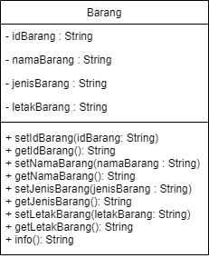
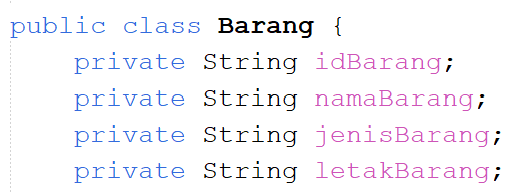
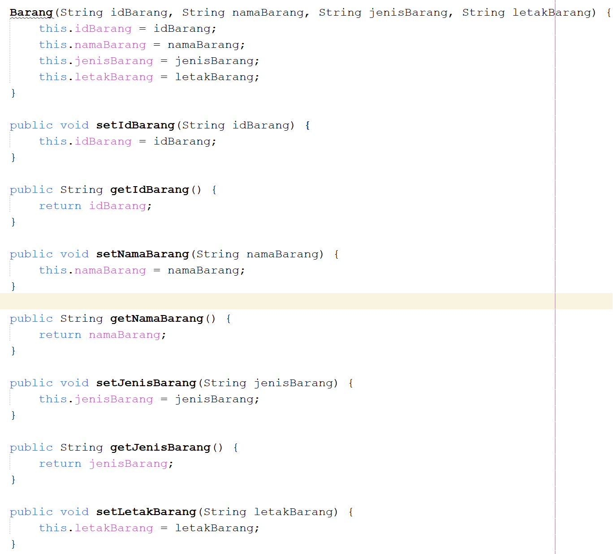
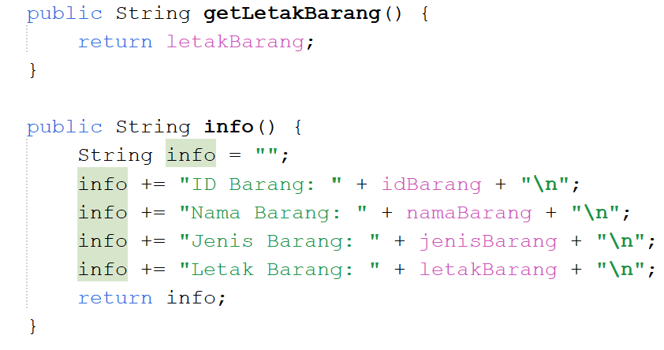
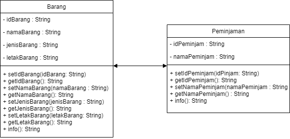

# Quiz 1 PBO

Nama : Faradilla Roudhotul Sa'naa  
Kelas / NIM : 2C / 2241720205  
Materi : Quiz 1 

## 1. Class dan Object 

*a.* Apa yang dimaksud dengan "class" dalam pemrograman berorientasi objek?  
    **Jawab:** Class adalah sebuah wadah yang digunakan untuk menampung objek. Yang dimana menampung ini berarti mendefinisikan atribut dan method yang dimiliki oleh objek. 

*b.* Bagaimana Anda mendefinisikan objek dari suatu class dalam bahasa pemrograman Java?  
    **Jawab :** Cara mendefinisikan objek dari suatu class adalah dengan instansiasi. Contoh dari instansiasi menggunakan class “Barang” adalah Barang brg1 = new Barang();. Proses instansiasi identic dengan kata “new”. 

*c.* Misalkan Anda memiliki class "Barang" dalam sistem informasi inventaris. 
    Bagaimana Anda akan membuat objek "laptop" dari class tersebut?  
    **Jawab :** Barang laptop = new Barang();. Yang dimana Barang adalah nama barang dan laptop adalah nama objek, lalu di instansiasi dengan “new” disertakan kelas Barang. 

## 2. Encapsulation

*a.* Jelaskan konsep encapsulation dalam pemrograman berorientasi objek dan mengapa hal ini penting dalam pengembangan sistem informasi inventaris barang.  
    **Jawab :** Karena konsep ini menggabungkan class, methods, dan variabels sekaligus tetapi dengan memberikan codingan tetap terlihat bersih atau rapi. Serta konsep ini dapat memberikan hak akses pada property atau method, yang dimana tujuannya adalah agar tidak semua class terbaca. 

*b.* Dalam konteks sistem informasi inventaris, sebutkan contoh atribut (variabel) yang harus di-encapsulate dan mengapa.  
    **Jawab :** Menurut saya contoh atribut yang harus di enkapsulasi adalah idBarang, namaBarang, hargaBarang. Yang dimana idBarang merupakan identitas dari suatu barang, maka harus diberi enkapsulasi agar tidak dapat diakses oleh sembarang kelas. namaBarang agar dapat melindungai integritas data yang disimpang agar tidak dapat diubah. hargaBarang, atribut ini menjadi informasi yang sensitive maka harus di enkapsulasi agar dapat membatasi hak akses. 

## 3. Relasi Kelas

*a.* Apa yang dimaksud dengan relasi antara kelas dalam pemrograman berorientasi objek?  
    **Jawab :** Relasi antara kelas adalah kelas yang memiliki keterkaitan antara kelas yang satu dengan yang lainnya, yang dimana kelas akan saling terhubung dalam pemrograman berorientasi objek.

*b.* Dalam sistem informasi inventaris barang, bagaimana Anda akan menggambarkan relasi antara kelas "Barang" dan kelas "Kategori"?  
    **Jawab :** Kelas “Barang” menjadi objek pada kelas “Kategori” dikarenakan setiap barang dapat memiliki kategori yang berbeda.  

## 4. PBL

*a.* Berdasarkan kasus sistem informasi inventaris barang, coba buat sebuah class sederhana beserta atribut dan metodenya yang menggambarkan suatu entitas dalam sistem tersebut (misalnya, class "Barang").  
    **Jawab :**     
      
      
    

*b.* Bagaimana Anda akan menggunakan encapsulation untuk melindungi atributatribut dalam class tersebut?  
    **Jawab :** Dengan memberikan private pada atribut yang diperlukan dalam class tersebut.  
    

*c.* Gambarkan hierarki class atau hubungan antar class yang mungkin ada dalam sistem informasi inventaris barang di jurusan Teknologi Informasi. Berikan contoh relasi antar class (misalnya, inheritance atau association) dalam konteks tersebut.  
    **Jawab :**     
    Hubungan antar class yang mungkin dalam sistem informasi inventaris peminjaman barang adalah hubungan asosiasi dikarenakan hubungan asosiasi ini berarti bahwa antar class memiliki hubungan tetapi tidak saling memiliki. Seperti contoh yang telah diberikan, hubungan antara peminjaman dan barang yang tidak memiliki kepemilikan objeka antara satu sama lain, yang dimana peminjaman hanya mencatat siapa yang meminjam barang. 

