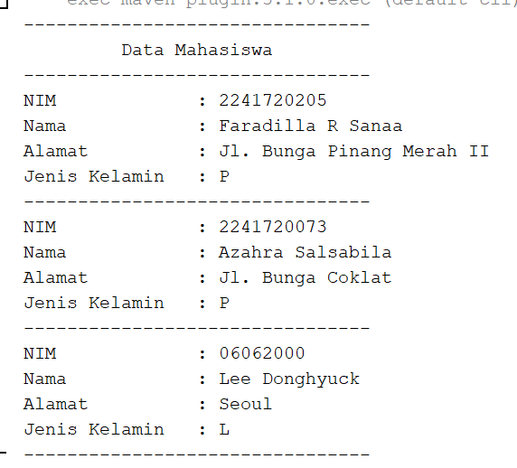
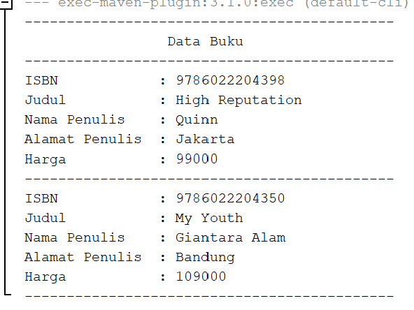

# UTS PBO 

Nama : Faradilla Roudhotul Sa'naa  
Kelas / NIM : 2C / 2241720205  
Materi : UTS PBO 

## Soal 1 : Penulisan Class 
Berdasarkan contoh class ClassA dibawah ini, jelaskan apakah penulisan source code pada contoh class tersebut sudah benar. Jika tidak, apa yang perlu diperbaiki?     
    **Jawab :** Penulisan source code pada class tersebut masih belum benar, karena pada class tersebut method hitung tidak memberikan nilai kembalian. Jika mendeklarasikan suatu method tanpa void maka harus memberikan nilai kembalian method tersebut. Pada class tersebut menggunakan method float tetapi tidak diberikan pernytaan return untuk mengembalikan nilai float, maka perbaikan yang dapat dilakukan adalah dengan memberikan return. Berikut perbaikan yang dapat dilakukan :    

## Soal 2 : Perhitungan Jumlah Elemen Array 2 Dimensi 
Pada class SoalArray1, terdapat array 2 dimensi dengan ukuran 3x3. Tuliskan code Java untuk menghitung jumlah total elemen array tersebut menggunakan perulangan.     
    **Jawab :**   Kode Program :    Hasil Running :   

## Soal 3 : Pewarisan Atribut dan Method 
Pada source code yang diberikan, class ClassY merupakan turunan dari class Class. Sebutkan atribut dan method apa saja yang diwarisi oleh ClassY dari kelas induknya (class Class). Jelaskan juga apa output dari code yang ditulis pada class ClassY dan bagaimana nilai tersebut diperoleh.        
    **Jawab :** Atribut dan method yang diwarisi ClassY dari class induk (class Class) adalah method hitung yang dimana dalam method hitung terdapat atribut a dan x. Output yang dihasilkan diperoleh dari subclass yang mengambil atribut serta method dari superclass, yang dimana artinya ClassY mengambil atribut serta method yang terdapat dalam class Class, dalam class Class terdapat atribut a dan x yang dihitung pada method hitung(), lalu ClassY mengambil atribut dan method dari class Class menggunakan extends. Dalam ClassY terdapat atribut b dan y yang dihitung menggunakan method hitungY(), dalam method hitungY() terdapat method hitung() dari superclass (class Class). Artinya dalam method hitung() = 0 + 5 * 2 = 10 dan method hitungY() = hitung() * b = 10 * 5 = 50. Maka main akan menghasilkan 50.   Hasil Running:   

## Soal 4 : Class Mahasiswa dengan Constructor
Dalam class Mahasiswa, lengkapi code dengan:  
a. Menambahkan constructor untuk mengisi atribut nim, nama, alamat, dan jenisKelamin.  
b. Membuat objek mahasiswa dan mengisi atribut nim, nama, alamat, dan jenisKelamin melalui constructor.     
    **Jawab :**   Kode Program :         Hasil Running :   

## Soal 5 : OOP Buku -> Penulis
Perhatikan class diagram berikut dan Buatlah Source Code dalam Bahasa java berdasarkan class diagram tersebut.     
    **Jawab :** Kode Program :   
    Class Buku      
    Class Penulis      
    Class Main     
    Hasil Running :   